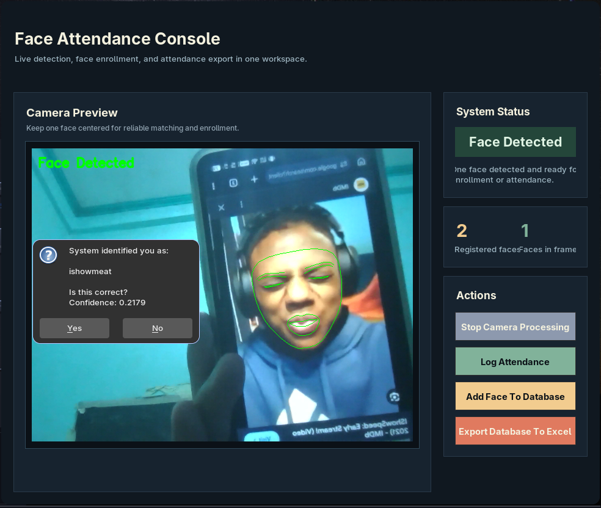
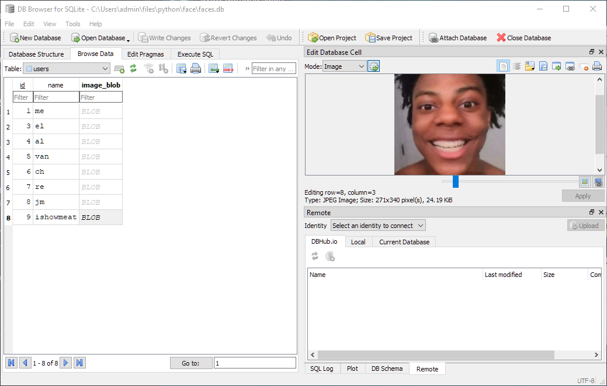
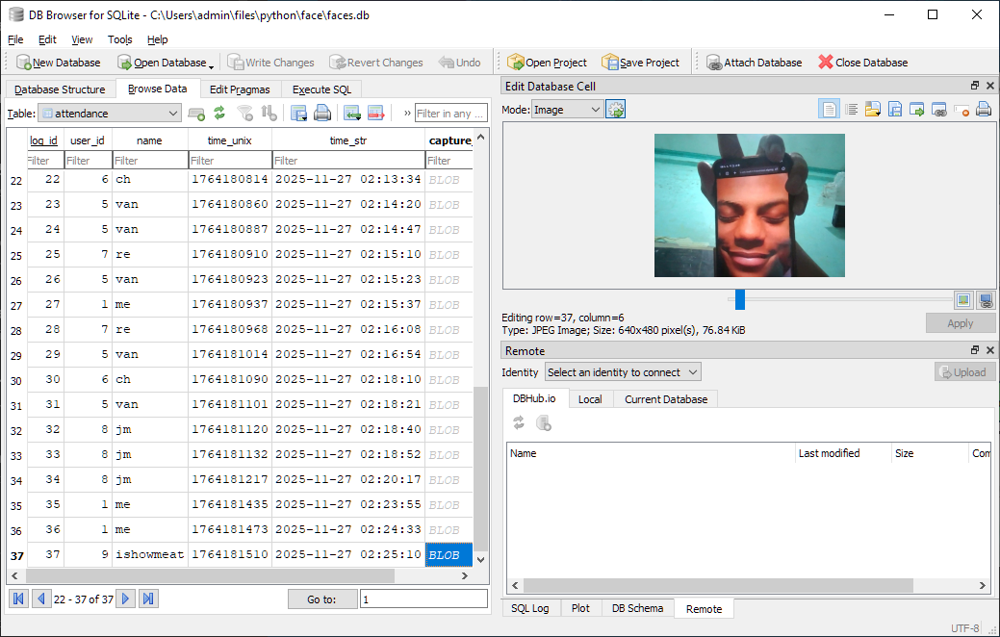

# FloppyFaceDetector

something i made for a project at 3am

## Features

uses DeepFace (ArcFace model), Mediapipe tasks and OpenCV (and other shenanigans) to log your attendance using your face.

saves your attendance on an sqlite db and export it to excel

## usage

1. clone this repo
2. use python 3.11.9 (preferably make a venv first, you'll figure it out)
3. install mediapipe, opencv, deepface
4. uninstall protobuf (you may run into multiple package conflicts that breaks the code), use 5.29.1 (`pip install protobuf==5.29.1`)
5. run `main.py`
6. ???
7. profit
